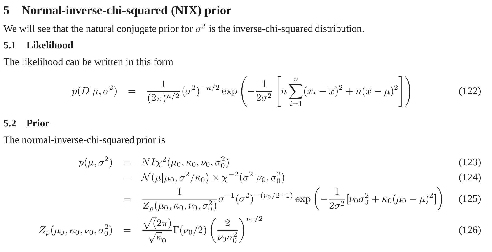
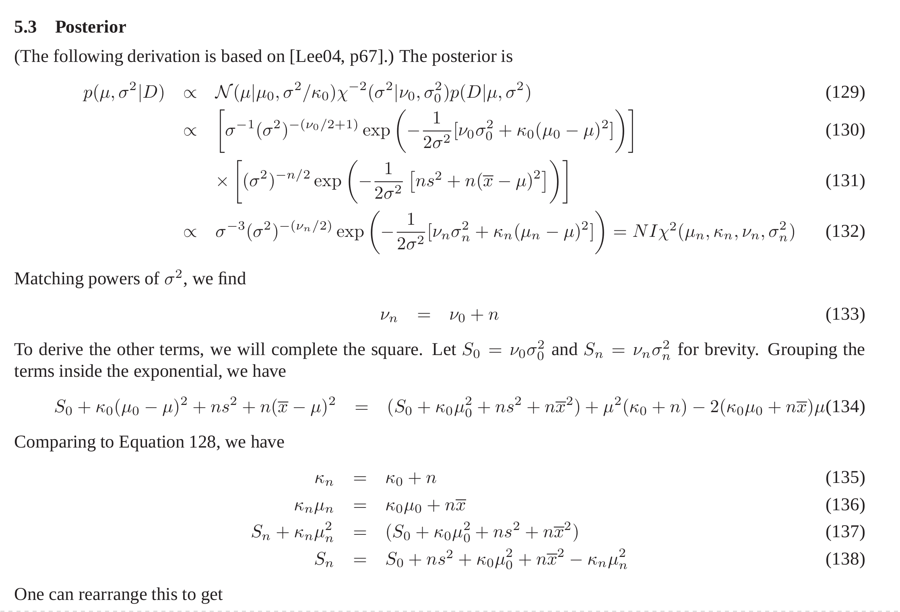
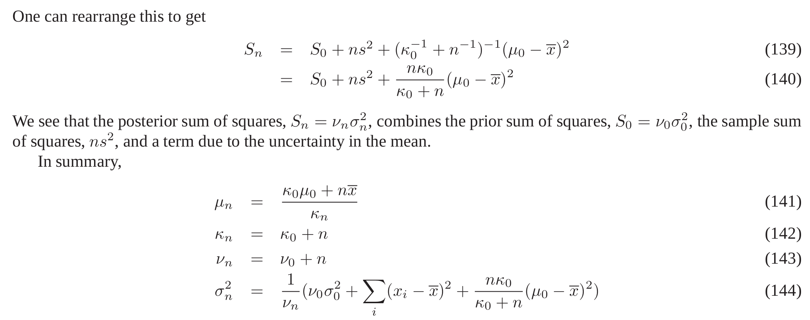

```{r preamble, output="hide", echo=FALSE}

library(tidyverse)
library(purrrlyr)
## devtools::install_github("kleinschmidt/beliefupdatr", agrs="--preclean")
library(beliefupdatr)

knitr::opts_chunk$set(cache=TRUE, echo=FALSE, message=FALSE, error=FALSE)

set.seed(1)

```

# What does it mean to sample from a distribution?

---

```{r}
p <- data_frame(vot = seq(-20, 120),
           lhood = dnorm(vot, mean=60, sd=21)) %>%
  ggplot(aes(x=vot)) +
  geom_line(aes(y=lhood)) +
  ggtitle("Distribution")
p
```

---

```{r}
vot_samples <- data_frame(vot=rnorm(100, mean=60, sd=21))
p + geom_rug(data=vot_samples) +
  ggtitle("Samples drawn from distribution")
```

---

```{r}
p +
  geom_rug(data=vot_samples) +
  geom_histogram(data=vot_samples, aes(y=..density..), alpha=0.5) +
  ggtitle("Histogram of samples approximates distribution")
```

# Updating beliefs

## Quantifying uncertainty

* We have two categories /b/ and /p/.  
* Realized as normal distributions on an acoustic cue $$ p(\mathrm{VOT} | \mu, \sigma^2) $$
* We **don't know** the mean $\mu$ and variance $\sigma^2$.
* Express our uncertainty as a **probability distribution** over the mean and
  variance: $$p(\mu, \sigma^2)$$
* This distribution assigns a **degree of belief** for each particular
  combination of mean $\mu$ and variance $\sigma^2$.

## Learning from experience

* How do we **update our beliefs** based on experience?
* **Conceptually**, Bayes Rule: $$ p(\mu, \sigma^2 | x) \propto p(\mathrm{VOT}=x | \mu, \sigma^2) p(\mu, \sigma^2) $$

---

```{r}

prior <- list(b = nix2_params(mu = 10, sigma2 = 43, kappa = 3, nu = 10),
              p = nix2_params(mu = 52, sigma2 = 460, kappa = 3, nu = 10))


xs <- seq(-20, 120)
predict <- function(beliefs, xs) {
  map2(beliefs, names(beliefs),
       ~ data_frame(category = .y,
                    vot = xs,
                    lhood = d_nix2_predict(xs, .x))) %>%
    lift(bind_rows)()
}

prior_pred <- prior %>%
  predict(xs)

p <-
  prior_pred %>%
  ggplot(aes(x=vot, color=category)) +
  geom_line(aes(y=lhood)) +
  ggtitle("Predictions from prior beliefs") +
  ylim(-0.0025, 0.055)
p

```

---

```{r, dependson=-1}
one_dat <- data_frame(vot = 42, category="p")
p + geom_rug(data=one_dat) + ggtitle("Observed data point")

```

---

```{r, dependson=-1}
## updated_beliefs <- map(prior['p'], nix2_update_one, one_dat$vot)
updated_beliefs <- update_list(prior, p = nix2_update_one(prior$p, one_dat$vot))
post_pred <- updated_beliefs %>% predict(xs)
ggplot(prior_pred, aes(x=vot, color=category)) +
  geom_line(aes(y=lhood), alpha=0.5, linetype=3) +
  geom_line(data=post_pred, aes(y=lhood)) +
  geom_rug(data=one_dat) +
  ggtitle("Updated beliefs after one observation")

```

## How??



## How???



## How????



## Enough

* Working with the distribution directly is **hard**.
* Neither **researchers** nor **brains** want to do a lot of algebra.
* What if there was a better way?!
* Replace continuous **distribution** $p(\mu, \sigma^2)$ with **samples** of plausible hypotheses.
* Re-weight samples based on how well they predict the data

## One sample of prior $p(\mu,\sigma^2)$

```{r}

draw_samples <- function(beliefs, n) {
  map2(beliefs, names(beliefs),
       ~ r_nix2(n, .x) %>%
         as_data_frame() %>%
         mutate(category=.y,
                sample = row_number(),
                weight = 1/n)) %>%
    lift(bind_rows)()
}

pred_samples <- function(samples, xs) {
  samples %>%
    as_data_frame() %>%
    mutate(pred = map2(mean, variance,
                       ~ data_frame(vot = xs,
                                    lhood = dnorm(vot, mean=.x, sd=sqrt(.y))))) %>%
    unnest(pred)
}

prior %>%
  draw_samples(1) %>%
  pred_samples(xs) %>%
  ggplot(aes(x=vot, y=lhood, color=category)) +
  geom_line() +
  ylim(0, 0.09)
```

## Many samples approximate $p(\mu,\sigma^2)$

```{r}

prior_samples <- 
  prior %>%
  draw_samples(100)


prior_samples_pred <-
  prior_samples %>%
  pred_samples(xs)

prior_samples_pred_marg <-
  prior_samples_pred %>%
  group_by(vot, category) %>%
  summarise(lhood = mean(lhood))

p <- ggplot(prior_samples_pred,
       aes(x=vot, y=lhood, color=category)) +
  geom_line(aes(group=interaction(sample, category)), alpha=0.2) +
  ylim(0, 0.09)
p
```

## Many samples approximate $p(\mu,\sigma^2)$

```{r}
prior_samples_pred_marg <-
  prior_samples_pred %>%
  group_by(vot, category) %>%
  summarise(lhood = mean(lhood))

p <- p +
  geom_line(data=prior_samples_pred_marg, aes(linetype="Approx."), size=2) +
  scale_linetype_discrete("Method")
p  
```

## Many samples approximate $p(\mu,\sigma^2)$

```{r}
prior_samples_pred_marg <-
  prior_samples_pred %>%
  group_by(vot, category) %>%
  summarise(lhood = mean(lhood))

p + geom_line(data=prior_pred, aes(linetype="Exact"), size=2)
```

## Weighting samples by importance

* How do you **update** samples to reflect new information?
* Notation: for each category, there are $K$ samples of $(\mu_k, \sigma^2_k)$,
  where $k = 1 \ldots K$.
* Samples are all equally representative of prior, so have the same **initial
  weight**: $w^k_0 = 1/K$.
* Re-weight samples based on **likelihood** of data given that sample (how well
  hypothesis predicts data): $$ w^k_n = w^k_0 p(x_1, \ldots, x_n | \mu_k, \sigma^2_k) $$

----

```{r}

p <- ggplot(prior_samples_pred,
       aes(x=vot, color=category)) +
  geom_line(aes(y=lhood, group=interaction(sample, category), alpha=weight)) +
  ylim(0, 0.09) + ggtitle("Prior samples")
p
```

---

```{r}

p +  geom_rug(data=one_dat) + ggtitle("Prior samples with one observation")
```

---

```{r}
reweight_samples <- function(samples, x, x_category) {
  samples %>%
    mutate(lhood = map2_dbl(mean, variance, ~dnorm(x, mean=.x, sd=sqrt(.y))),
           weight = ifelse(category == x_category, weight*lhood, weight)) %>%
    group_by(category) %>%
    mutate(weight = weight/sum(weight),
           lhood = NULL) %>%
    ungroup()
}

samples_one_post_pred <-
  reweight_samples(prior_samples, one_dat$vot, "p") %>%
  pred_samples(xs)

p <- samples_one_post_pred %>%
  ggplot(aes(x=vot, color=category)) +
  geom_line(aes(y = lhood, alpha=weight, group=interaction(sample, category))) +
  geom_rug(data=one_dat) +
  ylim(0, 0.09) +
  ggtitle("Re-weighted samples")
p
```

---

```{r}

samples_post_one_pred_marg <-
  samples_one_post_pred %>%
  group_by(vot, category) %>%
  summarise(weight = sum(weight), lhood = mean(weight*lhood))

p + geom_line(data = samples_post_one_pred_marg,
              aes(y=lhood, linetype="Approx."), size=2) +
  geom_line(data=post_pred, aes(y=lhood, linetype="Exact"), size=2)


```


```{r, eval=FALSE}


dat <- supunsup::supunsup_clean %>%
  filter(bvotCond == "0") %>%
  filter(subject == first(subject)) %>%
  select(trial, trueCat, vot) %>%
  mutate(block = ntile(trial, 10))


dat %>% group_by(block) %>% nest()


xs <- seq(-20, 90)
predict <- function(beliefs, xs) {
  map2(beliefs, names(beliefs),
       ~ data_frame(category = .y,
                    vot = xs,
                    likelihood = d_nix2_predict(xs, .x))) %>%
    lift(bind_rows)()
}

tmp <-

p <-   

updated_params <-
  dat %>%
  beliefupdatr::belief_update_batch("vot", "trueCat", "trial", seq(23, 221, length.out=10),
                                    prior) 

updated_predictions <- 
  updated_params %>%
  unnest(map(beliefs, predict, xs))

data_by_block <-
  map(unique(updated_params$trial),
      ~ dat %>% filter(trial <= .x) %>% mutate(trial=.x, category='trueCat')) %>%
  lift(bind_rows)()

ggplot(updated_predictions,
       aes(x=vot, y=likelihood, color=category, alpha=trial, frame=trial,
           group=interaction(category, trial))) +
  geom_line() +
  geom_point(data=data_by_block, aes(y=0, color=trueCat), position=position_jitter(h=0, w=10))


%>%
  gather("category", "beliefs", -trial)

 %>%
  mutate(predictions = map(beliefs, predict))


true_dists <- list(b = list(mu = 0, sigma2 = 70),
                   p = list(mu = 40, sigma2 = 70))

data <- data_frame(trial = 1:


```
